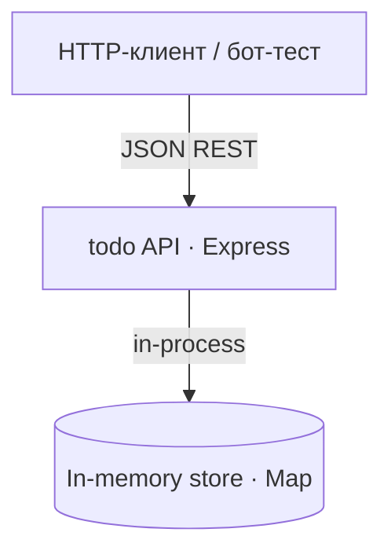
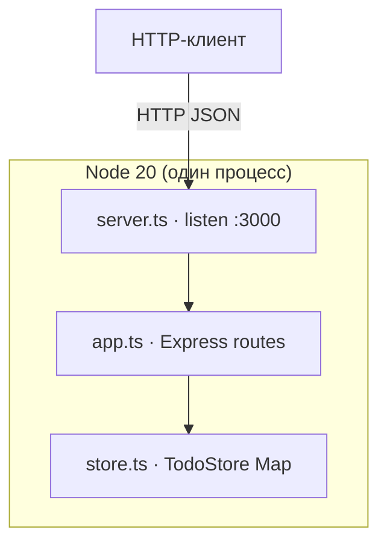

# Architecture Overview

> **Живой документ.** Обновляется по мере того, как архитектура устаканивается.
> До `/adopt-architecture` содержит только заглушку.
> После `/adopt-architecture` — высокоуровневая C4-диаграмма (System Context).
> После `/adopt-stack` — Containers и детальное описание контейнеров.

## C4: System Context

Единственный внешний актор — HTTP-клиент (curl, тест supertest, будущий бот). Внешних систем,
БД и интеграций нет: всё состояние живёт в памяти процесса.

## C4: Containers

- `server.ts` — bootstrap: создаёт store + app, слушает порт.
- `app.ts` — маршруты REST (`/health`, `/todos` CRUD), валидация ввода.
- `store.ts` — `TodoStore` над `Map`, инкапсулирован для свежего состояния в тестах.

## Главные потоки

См. [flows/](flows/).

## Связки

- [docs/idea/01-idea.md](../idea/01-idea.md) — идейное ядро
- [docs/adr/](../adr/) — все архитектурные решения
- [core/](core/) - [data/](data/) - [flows/](flows/) - [integrations/](integrations/) - [stack/](stack/) - [nfr/](nfr/) - [roadmap/](roadmap/)
- [AGENTS.md](../../AGENTS.md)
