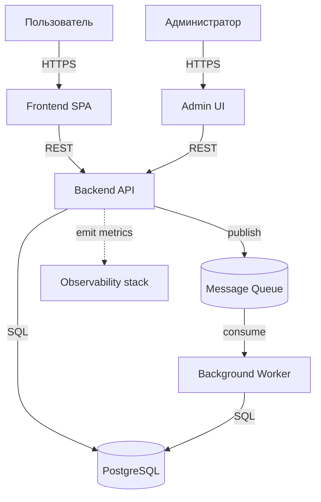
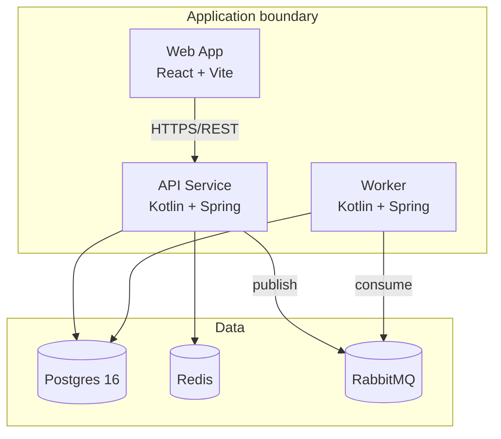

# Adopt Architecture Playbook

> **Универсальная процедура.** Читается любым AI: Claude, Codex, DeepSeek, Minimax, Cursor, Gemini, Aider и т.п.
> **Триггер:** `/adopt-architecture` или фразы «выбираем архитектуру», «спроектируй архитектуру», «adopt architecture».
> **Тонкая обёртка для Claude Code:** [.claude/skills/adopt-architecture/SKILL.md](../.claude/skills/adopt-architecture/SKILL.md).

---

## Когда запускать

**После** того как `/init-project` завершён и `docs/idea/` наполнена.
**До** запуска `/adopt-stack` (выбор технологий).

Эта фаза — между «что строим» (Phase 0 Discovery) и «на чём пишем» (Phase 1 Stack Adoption).

**Зачем выделять отдельную фазу:** в реальной практике сначала ты решаешь архитектурные паттерны (монолит или микросервисы, request-response или event-driven, REST или GraphQL), и только потом — конкретные технологии под них. Если объединить — конкретика стека размывает архитектурное мышление, и важные развилки проходят мимо.

## Что делает эта команда

- Прорабатывает архитектурные развилки **в виде вопросов**, не предлагая стек.
- Создаёт **ADR** на каждое значимое архитектурное решение.
- Обновляет `docs/architecture/overview.md` высокоуровневой картинкой (C4-диаграмма на Mermaid).
- Заполняет подпапки `docs/architecture/core/`, `data/`, `flows/`, `integrations/`, `nfr/`, `roadmap/` базовыми описаниями.
- В конце — рекомендации, какие skill'ы стоит подключить под выбранную архитектуру.

## Алгоритм

### Шаг 1. Проверка готовности

Перед началом убедись:

- [ ] `docs/idea/01-idea.md` заполнен (не заглушка).
- [ ] `docs/idea/04-mvp.md` (минимум + capabilities — что система должна уметь) определён.
- [ ] `docs/idea/03-principles.md` заполнен (важно для контракта с AI).

Если что-то не готово — предложи пользователю сначала наполнить эти разделы (через `/sync-idea` или вручную). Без этого архитектурное обсуждение будет беспредметным.

### Шаг 2. Архитектурные развилки

Задай пользователю серию вопросов **одним сообщением**. Не перепрыгивай к решениям, пока он не ответит на все.

Группы вопросов:

**A. Тип системы (выбрать одно):**
- (a) Монолит (один процесс, одна кодовая база, проще в начале)
- (b) Модульный монолит (один процесс, чёткие модули с интерфейсами, можно потом разделить)
- (c) Микросервисы (несколько процессов, независимый деплой, оверхед на координацию)
- (d) Serverless / FaaS (функции по событиям, минимум инфраструктуры)
- (e) Гибрид (например, монолит + отдельный воркер)
- (f) Библиотека или CLI (не серверное приложение)

**B. Стиль взаимодействия (если применимо):**
- (a) Request/response (REST/GraphQL/gRPC) — синхронный
- (b) Event-driven (очереди, шина событий, pub/sub) — асинхронный
- (c) Гибрид: ядро sync, фоновые задачи через очередь
- (d) Не применимо (нет внешних клиентов)

**C. Контракт API (если есть API):**
- (a) REST + OpenAPI
- (b) GraphQL
- (c) gRPC / protobuf
- (d) JSON-RPC
- (e) Произвольный (доменный)
- (f) Не применимо

**D. Состояние и данные:**
- (a) Реляционная БД (Postgres, MySQL)
- (b) Документная БД (MongoDB, DynamoDB)
- (c) Key-value (Redis, KeyDB)
- (d) Поисковая (Elasticsearch, Meilisearch)
- (e) Несколько разных (polyglot persistence)
- (f) Без БД (stateless, in-memory, файлы)
- Сразу спрашивать про **миграции** и **транзакционные границы** — это важные архитектурные решения.

**E. Авторизация / идентификация:**
- (a) Сессии (cookie-based)
- (b) JWT / OAuth 2.1
- (c) Внешний IdP (Auth0, Keycloak, Cognito)
- (d) API keys
- (e) Не применимо (внутренний инструмент, без auth)

**F. Деплой и инфраструктура:**
- (a) Docker Compose на одном сервере
- (b) Kubernetes
- (c) Serverless platform (Vercel, Cloudflare Workers, AWS Lambda)
- (d) PaaS (Heroku, Railway, Fly.io)
- (e) Static hosting (для фронта)
- (f) Bare metal / VM

**G. Observability (мониторинг и логи):**
- (a) Структурированные логи в stdout + ELK / Grafana Loki
- (b) APM (Datadog, New Relic, Honeycomb)
- (c) OpenTelemetry с собственным backend
- (d) Минимум (только логи в файлы)

**H. Нефункциональные требования:**
- Какая ожидаемая нагрузка (RPS, число пользователей)?
- Требования к latency (p50/p95/p99)?
- SLA на доступность?
- Регуляторика (GDPR, HIPAA, PCI DSS)?
- Какие данные считаются критическими / чувствительными?

### Шаг 3. Запись каждого решения как ADR

**Каждое значимое решение → отдельный ADR** в `docs/adr/`.

Для архитектурной фазы обычно создаётся 4-8 ADR'ов в течение одной-двух сессий. Примеры:

- `YYYYMMDD-HHmm-monolith-vs-microservices.md`
- `YYYYMMDD-HHmm-event-driven-for-background-jobs.md`
- `YYYYMMDD-HHmm-api-style-rest-with-openapi.md`
- `YYYYMMDD-HHmm-postgres-as-primary-store.md`
- `YYYYMMDD-HHmm-jwt-with-external-idp.md`
- `YYYYMMDD-HHmm-deploy-on-docker-compose.md`

**Не объединяй несвязанные решения в один ADR.** Один ADR = один вопрос.

Каждый ADR использует шаблон [docs/adr/template.md](../docs/adr/template.md) и обязательно содержит секцию `## Alternatives considered` — какие варианты рассмотрены и почему отказались.

После каждого ADR — дописать строку в индекс в `AGENTS.md §3`.

### Шаг 4. C4-диаграмма в overview.md

Обнови `docs/architecture/overview.md` диаграммой на Mermaid. Минимум — System Context (кто пользователи, какие внешние системы). Если архитектура сложная — добавь Containers.

Пример System Context:



Пример Containers (детальнее):



### Шаг 5. Заполнить подпапки docs/architecture/

После создания ADR'ов и диаграммы — заполни базовое содержимое подпапок:

- **`core/`** — главные модули/компоненты системы и их зоны ответственности.
- **`data/`** — основные сущности, связи между ними, инварианты данных, стратегия миграций.
- **`flows/`** — главные сценарии (например, «регистрация пользователя», «обработка платежа»), для каждого — последовательная диаграмма или текстовое описание шагов.
- **`integrations/`** — внешние системы (третьи стороны, API, очереди), для каждой: protocol, аутентификация, retry policy, failure mode.
- **`nfr/`** — non-functional requirements: безопасность, расходы, перформанс, риски.
- **`roadmap/`** — что в MVP, что в Pilot, что в Scale. Сверь с `docs/idea/04-mvp.md` (раздел про этапы, если заполнен).

В каждом md обязательная секция `## Связки`. Валидация — `scripts/validate-links.sh`.

### Шаг 6. Запустить /skills-suggest для архитектурной части

После создания ADR'ов и обновления `docs/architecture/` — запусти `/skills-suggest` с фокусом на архитектуру/фронт/бэк.

Команда посмотрит на ADR'ы и предложит skills из каталога [.claude/recommended-skills.md](../.claude/recommended-skills.md):

- Если в ADR есть UI/фронт → frontend-design, web-design-guidelines
- Если React → плюс react-best-practices, composition-patterns
- Если e2e-тестирование UI → webapp-testing
- Архитектурного skill'а из marketplace **нет** — обсуди с пользователем, оставлять ли архитектурную работу на наш собственный playbook (этот) или подключить Superpowers как процессную дисциплину brainstorming → plan → execute.

**Никаких автоматических установок** — только список рекомендаций с командами, которые пользователь скопирует и запустит сам.

### Шаг 7. Финальный отчёт

Покажи пользователю:

> ✅ Архитектурная фаза завершена.
>
> **Создано:**
> - ADR: `<список с датами>`
> - `docs/architecture/overview.md` — диаграмма обновлена
> - Подпапки заполнены: core, data, flows, integrations, nfr, roadmap
>
> **Рекомендованные skills:** см. вывод `/skills-suggest`
>
> **Следующий шаг:**
> - `/adopt-stack` — выбрать конкретные технологии под эту архитектуру
>
> Локальный коммит сделан, не запушен.

### Шаг 8. Коммит

```bash
git add docs/adr/ docs/architecture/ AGENTS.md
git commit -m "feat(architecture): adopt initial architecture

- Decisions documented in ADRs (см. AGENTS.md §3)
- Overview diagram updated
- core/data/flows/integrations/nfr/roadmap filled in"
```

Без push.

## Что эта команда НЕ делает

- **Не выбирает технологии.** Не упоминает «Postgres», «React», «Kotlin» — только архитектурные классы. Конкретика — в `/adopt-stack`.
- **Не создаёт код.** Это всё ещё фаза без кода.
- **Не устанавливает skills автоматически.** Только рекомендует.
- **Не пушит.** Только локальный коммит.

## Правила

- Каждое решение — отдельный ADR, не объединять.
- `Alternatives considered` — обязательно для каждого ADR.
- Не пропускай вопросы группы H (нефункциональные требования) — они часто определяют архитектуру сильнее, чем функциональные.
- Если пользователь не знает ответ — пометь как «решим позже», не угадывай.

## Связки

- [METHODOLOGY.md](../METHODOLOGY.md) — три фазы и место архитектурной фазы
- [docs/adr/template.md](../docs/adr/template.md) — шаблон ADR
- [docs/architecture/](../docs/architecture/) — куда писать
- [init-project playbook](init-project.md) — предыдущий шаг (заполнение idea)
- [adopt-stack playbook](adopt-stack.md) — следующий шаг (выбор технологий)
- [skills-suggest playbook](skills-suggest.md) — рекомендации skill'ов
- [doctor playbook](doctor.md) — проверка окружения
