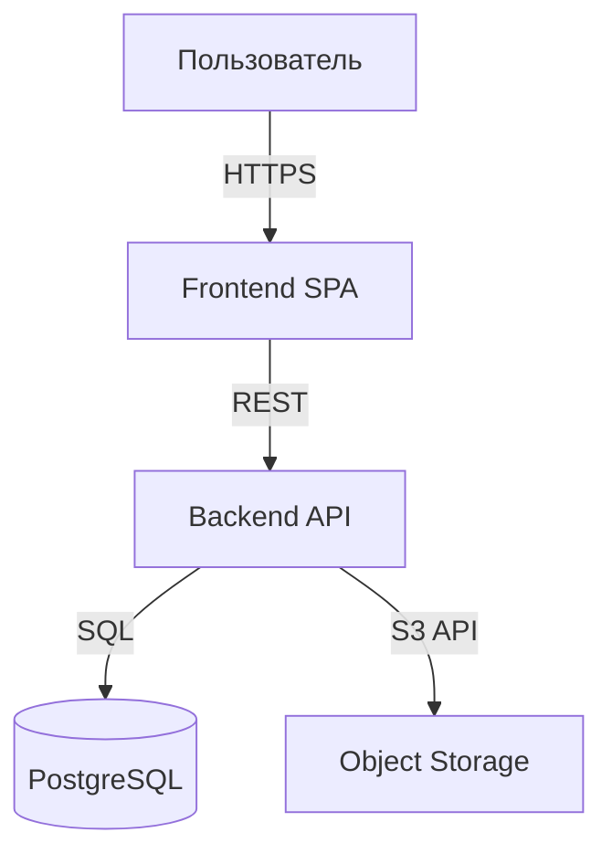

# Adopt Stack Playbook

> **Универсальная процедура.** Читается любым AI: Claude, Codex, DeepSeek, Minimax, Cursor, Gemini, Aider и т.п.
> **Триггер:** `/adopt-stack` или соответствующая фраза на естественном языке (см. таблицу триггеров в [AGENTS.md](../AGENTS.md)).
> **Тонкая обёртка для Claude Code:** [.claude/skills/adopt-stack/SKILL.md](../.claude/skills/adopt-stack/SKILL.md).

---

Переход Phase 0 → Phase 1. Материализует структуру под выбранный тип проекта.

**Запускать когда:** идея проработана, понятен тип системы, готов писать код.
**Можно запускать повторно:** при существенном изменении типа проекта (был фронт — добавили бэк).

## Шаг 1. Проверка готовности

- [ ] `docs/idea/01-idea.md` имеет реальное содержимое (не заглушка).
- [ ] `docs/architecture/overview.md` содержит хотя бы черновое описание высокоуровневых блоков (заполняется в `/adopt-architecture`).
- [ ] `docs/idea/04-mvp.md` определяет минимум, который реализуется в этой фазе.

Если что-то не готово — предложи пользователю сначала наполнить эти разделы (через `/sync-idea` или вручную).

## Шаг 2. Уточняющие вопросы

Задай разом (одним сообщением):

1. **Тип проекта:**
   - (a) `frontend-only` — только фронт (SPA, сайт)
   - (b) `backend-only` — только бэк (API, демон, CLI)
   - (c) `fullstack` — фронт + бэк в одном репо
   - (d) `monorepo-microservices` — несколько сервисов + общий код + контракты
   - (e) `library` — публикуемая библиотека/пакет
2. **Языки/фреймворки** (по слоям). Если пользователь не определился — предложи 2-3 варианта с обоснованием.
3. **БД и хранилища** (если применимо).
4. **CI-провайдер:** GitHub Actions / GitLab CI / другое.
5. **Способ деплоя:** Docker Compose / Kubernetes / serverless / static hosting.
6. **Критичные модули** (для mutation testing порог 85%) — список или «решим позже».

## Шаг 3. Создание ADR

`docs/adr/YYYYMMDD-HHmm-adopt-<type>-stack.md` — фиксирует выбор стека.

Структура: см. `docs/adr/template.md`. Особое внимание:
- `Alternatives considered` — какие стеки рассматривали, почему отказались.
- `Consequences > Follow-ups` — конкретные пункты на ближайший спринт.

Допиши строку в индекс ADR в `AGENTS.md` §3.

## Шаг 4. Генерация структуры кода

В зависимости от типа:

### frontend-only

```
<root>/
├── src/                       # исходники
├── public/                    # статика
├── e2e/                       # Playwright
├── package.json
├── vite.config.ts (или next.config.js)
├── tsconfig.json
├── eslint.config.js
├── stryker.config.json        # mutation testing
└── Dockerfile (если деплой контейнером)
```

### backend-only

```
<root>/
├── src/                       # исходники
├── tests/                     # unit + integration
├── migrations/                # БД (если применимо)
├── <манифест сборки>          # build.gradle.kts / pyproject.toml / go.mod / package.json
├── Dockerfile
└── infra/                     # docker-compose, env-templates
```

### fullstack

```
<root>/
├── backend/                   # см. backend-only
├── frontend/                  # см. frontend-only
├── contracts/openapi/         # API-контракты (single source of truth)
├── infra/                     # docker-compose, nginx, postgres init
└── deploy/                    # prod-compose, env-templates
```

### monorepo-microservices

```
<root>/
├── services/
│   ├── <service-1>/
│   ├── <service-2>/
│   └── ...
├── shared/                    # общие либы
├── contracts/                 # OpenAPI / protobuf
├── infra/                     # инфра + per-service compose
└── tools/                     # CLI-утилиты для разработки
```

### library

```
<root>/
├── src/                       # исходники
├── tests/                     # unit + property-based
├── examples/                  # минимальные примеры использования
├── docs/api/                  # сгенерированный API reference
└── <манифест сборки>
```

## Шаг 5. Pre-commit конфигурация

Обнови `.pre-commit-config.yaml`. Базовые хуки (gitleaks, commitlint, end-of-file-fixer) уже стоят — добавляй **стек-специфичные**:

| Слой | Что добавить |
|---|---|
| Go | `gofmt`, `goimports`, `staticcheck` |
| Python | `ruff format`, `ruff check`, `mypy` (опционально) |
| .NET | `dotnet format`, `dotnet build -warnaserror` |
| Java | Spotless + google-java-format, SpotBugs (CI) |
| Kotlin | `ktlint`, `detekt` (CI) |
| TS/JS | `prettier`, `eslint --max-warnings 0` |
| Vue/Angular/React | как TS/JS + `eslint-plugin-no-unsanitized` |
| YAML/JSON | `yamllint`, `jsonlint` |
| Shell | `shellcheck` |
| Dockerfile | `hadolint` |

## Шаг 6. CI pipeline под 9-шаговый гейт

Сгенерируй пайплайн (`.github/workflows/ci.yml` или `.gitlab-ci.yml`) с 9 шагами из `METHODOLOGY.md §7`:

1. **Pre-commit** — local-only (валидация что хуки настроены)
2. **Build & types** — компиляция + проверка типов
3. **SAST + Secret Detection** — gitleaks (full history), Semgrep или эквивалент
4. **SCA + License** — Trivy fs / Snyk / dependency-check
5. **Tests + coverage** — unit + integration; покрытие изменений ≥80%
6. **Mutation testing** — incremental, на изменённых файлах. Порог 75% / 85%
7. **SBOM** — CycloneDX; артефакт релиза
8. **Container/IaC scan** — Trivy image; Checkov для terraform
9. **Self-review checklist** (вместо MR-approvals для соло)

Тулзы под язык:

| Язык | Mutation tester | SAST |
|---|---|---|
| Go | `gremlins` | `gosec` |
| Python | `mutmut` | `bandit` |
| .NET | `Stryker.NET` | `Roslyn analyzers` |
| Java | **PIT (Pitest)** | `SpotBugs` |
| Kotlin | Pitest + Kotlin plugin | `detekt` |
| TS/JS/React/Vue/Angular | **Stryker** | `eslint-plugin-security` |

Все секреты CI — через переменные окружения провайдера (`GITHUB_TOKEN`, `GITLAB_TOKEN`, `SONAR_TOKEN`, ...).

## Шаг 7. Заполни scripts/local-ci.sh

Шаблон в `scripts/local-ci.sh` — пустой каркас. Заполни под выбранный стек:

```bash
#!/usr/bin/env bash
set -euo pipefail

echo "==> 1. Pre-commit"
pre-commit run --all-files

echo "==> 2. Build & types"
<команды-под-стек>

echo "==> 3. SAST + Secret Detection"
gitleaks detect --no-banner
<sast-команды>

echo "==> 4. SCA + License"
<sca-команды>

echo "==> 5. Tests"
<test-команды>

echo "==> 6. Mutation testing (incremental)"
<mutation-команда>

echo "==> 7. SBOM"
<sbom-команда>

echo "==> 8. Container scan"
<container-scan-команды>

echo "==> 9. Self-review checklist"
echo "  - [ ] Соответствует ли изменение задаче?"
echo "  - [ ] Правильно ли понят контракт (входы, выходы, инварианты)?"
echo "  - [ ] Не дублирует ли реализация уже существующее?"
echo "  - [ ] Адекватны ли тесты бизнес-смыслу?"
echo "  - [ ] Нет ли 'глотания' ошибок (catch (e) {}, except: pass)?"

echo "==> ✅ Все шаги пройдены"
```

## Шаг 8. Обнови AGENTS.md

- §0: убрать метку `🚧 stack: not yet chosen`, поставить `✅ stack: <type>`.
- §1: заполнить таблицу «Стек» с конкретикой.
- §3: записать новый ADR adopt-stack в индекс.
- §4.1: дописать конвенции имён файлов под стек, если нужно (например, миграции `V{N}__snake_case.sql` для Flyway).

## Шаг 9. Обнови docs/architecture/overview.md

Добавь C4-диаграмму на Mermaid:



И заполни секции под выбранный тип:
- `core/` — какие модули
- `data/` — какие сущности и связи
- `flows/` — главные потоки данных
- `integrations/` — внешние системы
- `stack/` — детальное описание стека (продолжение AGENTS.md §1)
- `nfr/` — нефункциональные требования
- `roadmap/` — первая фича + что дальше

В каждом — секция `## Связки`.

## Шаг 10. Финальный коммит

```bash
git add -p   # просмотри изменения
git add .github/ .gitlab-ci.yml .pre-commit-config.yaml scripts/local-ci.sh \
        AGENTS.md docs/ <папки-кода>
git commit -m "feat(scaffold): adopt <type> stack

- Generated <type> structure: <папки>
- Configured pre-commit for <языки>
- CI pipeline with 9-step quality gate
- See ADR YYYYMMDD-HHmm-adopt-<type>-stack"
```

Не пушим автоматически — push отдельной командой.

## Шаг 11. Запусти /doctor и /skills-suggest

После коммита прогони две команды:

1. **`/doctor`** (см. [doctor playbook](doctor.md)) — проверит стек-специфичные `contextual` инструменты, которые этот же `/adopt-stack` дописал в [`.claude/expected-tools.md`](../.claude/expected-tools.md) на Шаге 5–6. Покажет, чего не хватает, и команды установки.
2. **`/skills-suggest`** (см. [skills-suggest playbook](skills-suggest.md)) — посмотрит на новый стек и предложит skills из каталога [`.claude/recommended-skills.md`](../.claude/recommended-skills.md): фронтовые / React-специфичные / документные / тестировочные — в зависимости от выбора.

Обе команды — **только показывают**, не устанавливают. Если пользователь уже подтверждал `/doctor`-отчёт ранее в этом проекте — `doctorAcknowledged` в `.claude/settings.local.json` отключит автоматический повтор; `/skills-suggest` запускается всегда (он не повторяется навязчиво — каждый запуск даёт свежие рекомендации под текущий стек).

Не блокируй сессию даже если в `contextual` или `required` чего-то нет.

## Шаг 12. Финальный отчёт

> ✅ Phase 1 завершена. Стек: `<type>`.
>
> **Создано:**
> - Структура кода: `<список папок>`
> - Pre-commit: `<хуки>`
> - CI: `<provider>` с 9 шагами качества
> - `scripts/local-ci.sh` под выбранный стек
> - ADR: `YYYYMMDD-HHmm-adopt-<type>-stack.md`
>
> **Состояние окружения:** см. вывод `/doctor` выше. Если в required или contextual чего-то нет — доустанавливай перед запуском `/full-ahead`.
>
> **Рекомендованные skills:** см. вывод `/skills-suggest` выше.
>
> **Следующий шаг:**
> - `/plan <first-feature>` — план первой фичи
> - Запусти `/full-ahead` чтобы проверить, что пайплайн зелёный на пустом коде

## Связки

- [METHODOLOGY.md](../METHODOLOGY.md) §1 — три фазы
- [docs/adr/template.md](../docs/adr/template.md) — шаблон ADR
- [init-project playbook](init-project.md) — предыдущий шаг
- [plan playbook](plan.md) — следующий шаг
- [full-ahead playbook](full-ahead.md) — полный цикл проверок
